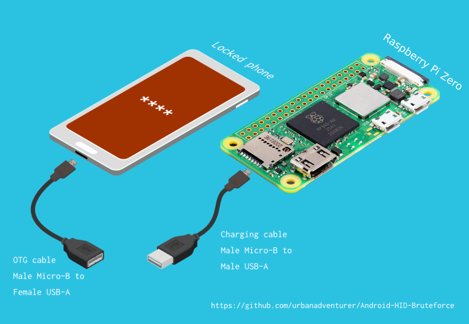

# 🔓📱🍓 Android-PIN-Bruteforce-Pi

Unlock an Android phone (or device) by bruteforcing the lockscreen PIN using a
Raspberry Pi Zero (or a Strawberry Pi Zero if there's no raspberry emoji yet).

## 📱 How it works

It uses a USB OTG cable to connect the locked phone to the Nethunter device.
It emulates a keyboard, automatically tries PINs, and waits after trying too
many wrong guesses.

[Raspberry Pi Zero] ⟷ [USB cable] ⟷ [USB OTG adaptor] ⟷ [Locked Android phone]

The USB HID Gadget driver provides emulation of USB Human Interface Devices (HID).
This enables a Raspberry Pi Zero to emulate keyboard input to the locked phone.
It's just like plugging a keyboard into the locked phone and pressing keys.

### You will need

- A locked Android phone
- a Raspberry Pi with OTG support with a USB male Micro-B cable to power it
- USB OTG (On The Go) cable/adapter (USB male Micro-B to female USB A), and a standard charging cable (USB male Micro-B to male A).
- That's all!

## Installation

1. Install a Linux-based OS onto the Raspberry Pi, [configure the Wi-Fi access](https://www.raspberrypi.org/documentation/configuration/wireless/headless.md),
[enable SSH](https://www.raspberrypi.org/documentation/remote-access/ssh/README.md) and log in to it
1. Clone this repository onto the Pi
1. Run `make` to compile the `hid-keyboard` binary (originally [from NetHunter](https://gitlab.com/kalilinux/nethunter/apps/kali-nethunter-app/blob/f1ab685d7174f7a140a0d38490ecd7d079784578/assets/nh_files/modules/hid-keyboard.c))
1. Run `sudo dtoverlay dwc2` and `reboot`
1. After reboot, double-check that `dwc2` appears in the `lsmod` output, meaning that USB
OTG support is enabled.
1. Run `sudo ./create-hid-keyboard.sh`, which will create a `/dev/hidg0` device
through which keyboard events can be fed.
1. Finally follow the rest of the instructions in the [original README](https://github.com/urbanadventurer/Android-PIN-Bruteforce).
Make sure to change the `HID_KEYBOARD` configuration variable to point to the
newly-compiled `hid-keyboard` binary above.

## Licenses

This repository is licensed under the GNU GPL v3 or later.